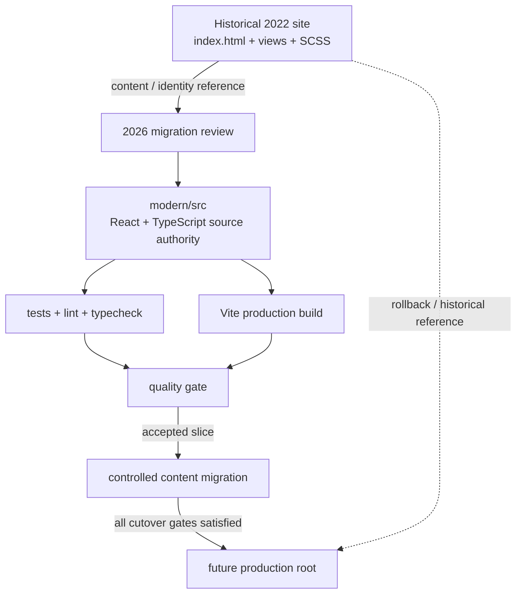

# Modern app architecture and migration boundary

## Decision

The 2026 application is introduced under `modern/` instead of replacing the historical root site immediately.

This keeps three concerns separate:

1. **Historical evidence** — the original 2022 HTML/SCSS implementation remains inspectable.
2. **Modern source authority** — new product code has one explicit source location.
3. **Cutover risk** — deployment replacement happens only after CI and QA evidence exist.

## Authority map

## Current runtime/tooling boundary

The modern app uses Node 24 and pnpm, matching the current application baseline used in TOP where useful. React and Vite can move faster than compiler/lint ecosystems, so compiler/tooling versions are selected by supported compatibility rather than by numeric recency alone.

For the first scaffold, TypeScript 6 is preferred over TypeScript 7 because the current TypeScript ESLint line explicitly supports TS6 while TS7 remains a compatibility boundary to evaluate separately.

## Dependency authority

`modern/package.json` declares intent. `modern/pnpm-lock.yaml` records the resolved dependency graph. CI installs from the lockfile with frozen resolution.

No normal development or CI path should require `--force` or legacy peer-dependency bypasses.

## CI boundary

Permanent quality CI must be read-only and must execute the same aggregate quality command used locally.

A temporary branch-bounded workflow may have write permission only to bootstrap the initial lockfile. Once the lockfile exists and validates, that workflow is removed and replaced by the permanent read-only quality gate.

## Content migration boundary

The modern shell may reuse verified concepts from the historical site, but old content is not automatically treated as current business truth.

In particular:

- service names can be preserved as historical categories;
- people/client references require review before being presented as current;
- the old contact form must not be represented as functional until a real submission boundary exists;
- historical visual assets are inventoried before promotion into the new app.

## Cutover gates

The modern app does not replace the root site until all of the following are true:

- frozen-lockfile install succeeds in CI;
- format, lint, typecheck, tests and production build are green;
- Home and remaining content slices have passed review;
- keyboard/accessibility and responsive QA are complete;
- production base paths/assets are verified for the chosen host;
- current-vs-historical content claims are explicit;
- rollback/reference instructions are documented.

## Non-goals

This migration does not introduce a backend, CMS, analytics suite, AI feature or container platform unless a concrete requirement justifies it.
