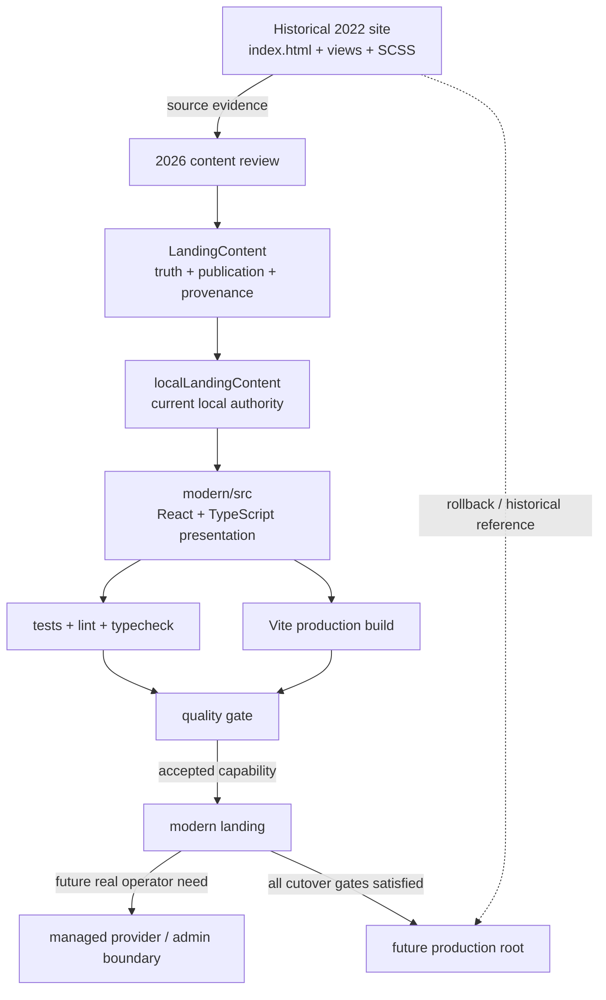

# Modern app architecture and migration boundary

## Decision

The 2026 application is introduced under `modern/` instead of replacing the historical root site immediately.

This keeps four concerns separate:

1. **Historical evidence** — the original 2022 HTML/SCSS implementation remains inspectable.
2. **Modern source authority** — new product code has one explicit source location.
3. **Content authority** — presentation is not the permanent storage layer for historical/current claims.
4. **Cutover risk** — deployment replacement happens only after CI and QA evidence exist.

## Authority map



The typed content authority tracked by #26 is now implemented locally. It is not permission to invent current content and it does not imply a backend already exists.

## Current runtime/tooling boundary

The modern app uses Node 24 and pnpm. React/Vite/compiler/lint versions are selected by supported compatibility rather than numeric recency alone.

TypeScript 6 is used because it is supported by the current TypeScript ESLint line. Tooling upgrades remain contract-driven: frozen install, lint, typecheck, tests and production build must continue to agree.

## Dependency authority

`modern/package.json` declares intent. `modern/pnpm-lock.yaml` records the resolved dependency graph. CI installs from the lockfile with frozen resolution.

No normal development or CI path should require `--force` or legacy peer-dependency bypasses.

## CI boundary

Permanent quality CI is read-only and executes the same aggregate quality command used locally:

```bash
cd modern
pnpm install --frozen-lockfile
pnpm check
```

Temporary branch-bounded workflows may exist only for one-shot qualification or repository-canonical formatting when the connector/runtime cannot execute that work directly. They must be restricted to the working branch/path, use minimum permissions and be removed before merge.

## Historical content boundary

The modern shell may reuse verified concepts from the historical site, but old content is not automatically treated as current business truth.

In particular:

- service names can be preserved as historical categories;
- people/client references require review before being presented as current;
- the old contact form must not be represented as functional until a real submission boundary exists;
- historical visual assets are inventoried before promotion into the new app;
- a historical label/photo does not establish a current relationship, role, service or endorsement.

The 2022 root remains evidence, not a live CMS.

## Content platform readiness — implemented local boundary

El Núcleo should be able to evolve like a modern maintained landing as verified information becomes available, without another frontend rewrite.

The architecture principle is:

> **CMS-ready now; CMS only when justified by real content operations.**

The current #26 slice implements a stable content contract before `/admin` or any vendor choice:

```text
Historical evidence / reviewed 2026 facts
                ↓
          LandingContent
                ↓
       localLandingContent
                ↓
          public landing

Future, only when justified:
managed provider / editor → same semantic contract → public landing
```

### Concrete authority files

- `modern/src/content/landing-content.ts` — presentation-independent aggregate types.
- `modern/src/content/local-content.ts` — current local registry/authority.
- historical content modules — source-specific historical datasets and item-level provenance.
- `modern/src/App.tsx` — presentation consumer, no longer the storage layer for page copy/collections.
- `docs/content-platform-2026.md` — truth/publication/provenance and future provider contract.

### Truth and publication semantics

Claim-bearing domains distinguish:

- `historical`;
- `verified-current`;
- `unverified`;
- `draft`.

Publication is a separate dimension:

- `public`;
- `withheld`.

A record existing in storage therefore does not mean it is current or safe to publish.

### Identity boundary

The implementation deliberately separates two concepts that initially appeared together:

- `siteIdentity` is historical and contains only the preserved `El Núcleo / CINE` name/tag/logo;
- `shell` is verified-current and contains 2026 editorial labels such as `Archivo 2022 · reconstrucción 2026` and the reconstruction footer.

This prevents modern editorial copy from inheriting a misleading `historical` status simply because it appears next to the old brand.

### Future current domains

The contract already has slots for current projects and current contact channels, but both are deliberately empty, `unverified` and `withheld`.

Historical service categories, 2022 client labels or the historical form are not auto-converted into current portfolio/contact content.

### Provider semantics

No generic remote-provider interface is introduced yet because there is only one real implementation. Creating it now would be speculative abstraction.

When a second source or asynchronous loading requirement exists, it must distinguish at least:

- valid success with content;
- valid success with an empty result;
- transport failure;
- malformed/invalid payload;
- unavailable/disabled provider.

Fallback policy must be explicit per content domain. A remote valid-empty result must not silently become unrelated historical local data simply because the UI has a fallback.

### Why Mora is reference, not template

`Mora-Petraglia-Landing` demonstrates useful patterns: separation between public/admin concerns, explicit content source, media boundary, documented fallback behavior and honest security limitations.

Those lessons do **not** authorize copying its implementation blindly. El Núcleo does not introduce Google Apps Script, Sheets, Drive, `sessionStorage` auth or another backend merely for portfolio novelty. Provider/auth/storage choices follow the real editor and publishing workflow once that workflow exists.

## Metadata boundary

`modern/index.html` remains the current runtime authority for initial public-document metadata.

The typed content authority also models the qualified SEO narrative so future content/build integration does not need a second semantic redesign. That does **not** mean runtime metadata is currently injected by React.

Canonical URL, `og:url`, `og:image`, sitemap and deployment-specific robots decisions remain deferred until a stable production origin exists. They must be introduced with the controlled deploy/cutover change that establishes that origin.

## Media boundary

`modern/public/media/` is the modern application's asset boundary. Historical originals remain unchanged in their archival paths.

Promoted assets retain provenance back to historical Git blobs. Essential media must not depend on third-party hotlinks. Derivatives are generated only when measured performance or richer future content justifies them, with source/process documented.

## Accessibility boundary

Public and future admin/editor surfaces share the same accessibility standard:

- semantic landmarks and heading hierarchy;
- keyboard reachability and visible focus;
- skip navigation where appropriate;
- reduced-motion support;
- sufficient contrast;
- informative media alternatives;
- no state communicated only through color/motion.

A future CMS/admin route is not exempt from focus lifecycle, validation, error handling or keyboard semantics.

## Contact boundary

The 2022 Contacto schema is preserved as historical evidence only.

A live contact capability requires an explicit destination and reviewed behavior for:

- transport;
- validation;
- privacy/data minimization;
- spam/abuse controls;
- error and retry states;
- user-visible delivery semantics.

Until then, the modern product contains no fake-success form or silent data collection.

## Current qualification

The content-platform branch has a permanent quality contract of **29/29 tests** plus:

- Prettier;
- ESLint with zero warnings;
- TypeScript `--noEmit`;
- Vite production build.

The final merge also requires production browser qualification because moving presentation authority into the registry must not change the already-approved responsive/accessibility/media behavior by accident.

## Cutover gates

The modern app does not replace the root site until all of the following are true:

- frozen-lockfile install succeeds in CI;
- format, lint, typecheck, tests and production build are green;
- historical content slices and the integrated visual system have passed review;
- keyboard/accessibility and responsive QA are complete;
- current-vs-historical content claims are explicit through the content authority;
- production base paths/assets are verified for the chosen host;
- production origin is known and metadata can receive real canonical/social URLs;
- rollback/reference instructions are documented;
- any managed provider actually required before launch has deterministic success/empty/error behavior.

## Non-goals

The reconstruction does not introduce technology merely to look modern.

Specifically:

- no backend/CMS vendor before real editor/content requirements justify it;
- no provider abstraction before a real second provider/asynchronous need exists;
- no analytics suite without a measurement/privacy requirement;
- no AI feature without a product use case;
- no container/orchestration layer unless deployment needs it;
- no fake current-business data to make the historical project appear larger;
- no destructive rewrite of the historical root before controlled cutover.

A future CMS/admin capability is **not** ruled out. Its semantic boundary now exists; only the concrete implementation is deliberately deferred until the operating model is known.
