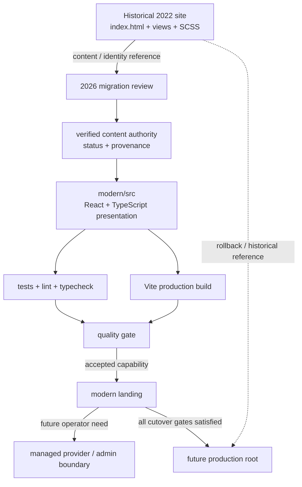

# Modern app architecture and migration boundary

## Decision

The 2026 application is introduced under `modern/` instead of replacing the historical root site immediately.

This keeps four concerns separate:

1. **Historical evidence** — the original 2022 HTML/SCSS implementation remains inspectable.
2. **Modern source authority** — new product code has one explicit source location.
3. **Content authority** — presentation must not become the permanent storage layer for historical/current claims.
4. **Cutover risk** — deployment replacement happens only after CI and QA evidence exist.

## Authority map



The `verified content authority` node is the next architecture lane tracked by #26. It is not permission to invent current content and it does not imply a backend already exists.

## Current runtime/tooling boundary

The modern app uses Node 24 and pnpm, matching the current application baseline used in newer projects where useful. React and Vite can move faster than compiler/lint ecosystems, so compiler/tooling versions are selected by supported compatibility rather than by numeric recency alone.

TypeScript 6 is used because it is supported by the current TypeScript ESLint line. Tooling upgrades remain contract-driven: frozen install, lint, typecheck, tests and production build must continue to agree.

## Dependency authority

`modern/package.json` declares intent. `modern/pnpm-lock.yaml` records the resolved dependency graph. CI installs from the lockfile with frozen resolution.

No normal development or CI path should require `--force` or legacy peer-dependency bypasses.

## CI boundary

Permanent quality CI is read-only and executes the same aggregate quality command used locally:

```bash
cd modern
pnpm install --frozen-lockfile
pnpm check
```

Temporary branch-bounded workflows may exist only for one-shot qualification or repository-canonical formatting when the connector/runtime cannot execute that work directly. They must be restricted to the working branch/path, use the minimum permissions required and be removed before merge.

## Historical content boundary

The modern shell may reuse verified concepts from the historical site, but old content is not automatically treated as current business truth.

In particular:

- service names can be preserved as historical categories;
- people/client references require review before being presented as current;
- the old contact form must not be represented as functional until a real submission boundary exists;
- historical visual assets are inventoried before promotion into the new app;
- a historical label/photo does not establish a current relationship, role, service or endorsement.

The 2022 root remains evidence, not a live CMS.

## Content platform readiness — next boundary

A concrete **capability requirement** now exists: El Núcleo should be able to evolve like a modern maintained landing as verified information becomes available, without another frontend rewrite.

The architecture principle is:

> **CMS-ready now; CMS only when justified by real content operations.**

The next lane (#26) therefore starts with a stable content contract, not with `/admin` or a vendor choice.

Conceptually:

```text
Historical evidence / verified updates
                ↓
       typed content contract
                ↓
      local content provider   ← first implementation
                ↓
          public landing

Future, only when justified:
managed provider / editor → same content contract → public landing
```

### Content contract requirements

The contract must be able to represent, at minimum:

- site/brand identity;
- hero/introduction;
- services/capabilities;
- projects/work samples when verified;
- backstage/media references;
- people/roles;
- client/reference labels;
- contact channels;
- section/SEO metadata.

Claim-bearing records must preserve status explicitly where relevant:

- `historical`;
- `verified-current`;
- `unknown` / `unverified`;
- `draft` / unpublished.

Presentation components must not infer current status merely because a historical record exists.

### Provider semantics

Before any remote provider is activated, the product must define these states separately:

- valid success with content;
- valid success with an empty result;
- transport failure;
- malformed/invalid payload;
- unavailable/disabled provider.

Fallback policy must be explicit per content domain. A remote valid-empty result must not silently become unrelated local data just because the UI has a fallback available.

### Why Mora is reference, not template

`Mora-Petraglia-Landing` demonstrates useful patterns: separation between public/admin concerns, explicit content source, media boundary, documented fallback behavior and honest security limitations.

Those lessons do **not** authorize copying its implementation blindly. El Núcleo will not introduce Google Apps Script, Sheets, Drive, `sessionStorage` auth or another backend merely for portfolio novelty. Provider/auth/storage choices follow the real editor and publishing workflow once that workflow exists.

## Metadata boundary

`modern/index.html` owns the current public-document metadata while a broader content authority is still being introduced.

Current metadata describes only what is provable today: a project initiated in 2022 and its 2026 reconstruction.

Canonical URL, `og:url`, `og:image`, sitemap and deployment-specific robots decisions are deferred until a stable production origin exists. They must be introduced in the same controlled deploy/cutover change that establishes that origin.

Future content-platform work should allow page metadata to derive from the same content authority rather than creating a second independent narrative.

## Media boundary

`modern/public/media/` is the modern application's asset boundary. Historical originals remain unchanged in their archival paths.

Promoted assets retain provenance back to historical Git blobs. Essential media must not depend on third-party hotlinks. Derivatives are generated only when measured performance or richer future content justifies them, with source/process documented.

## Accessibility boundary

Public and future admin/editor surfaces share the same accessibility standard:

- semantic landmarks and heading hierarchy;
- keyboard reachability and visible focus;
- skip navigation where appropriate;
- reduced-motion support;
- sufficient contrast;
- informative media alternatives;
- no state communicated only through color/motion.

A future CMS/admin route is not exempt from focus lifecycle, validation, error handling or keyboard semantics.

## Contact boundary

The 2022 Contacto schema is preserved as historical evidence only.

A live contact capability requires an explicit destination and reviewed behavior for:

- transport;
- validation;
- privacy/data minimization;
- spam/abuse controls;
- error and retry states;
- user-visible delivery semantics.

Until then, the modern product must contain no fake-success form or silent data collection.

## Cutover gates

The modern app does not replace the root site until all of the following are true:

- frozen-lockfile install succeeds in CI;
- format, lint, typecheck, tests and production build are green;
- historical content slices and the integrated visual system have passed review;
- keyboard/accessibility and responsive QA are complete;
- production base paths/assets are verified for the chosen host;
- current-vs-historical content claims are explicit;
- production origin is known and metadata can receive real canonical/social URLs;
- rollback/reference instructions are documented;
- any #26 content-provider work needed before launch has a deterministic local/failure path.

## Non-goals

The reconstruction does not introduce technology merely to look modern.

Specifically:

- no backend/CMS vendor before real editor/content requirements justify it;
- no analytics suite without a measurement/privacy requirement;
- no AI feature without a product use case;
- no container/orchestration layer unless deployment needs it;
- no fake current-business data to make the historical project appear larger;
- no destructive rewrite of the historical root before controlled cutover.

A future CMS/admin capability is **not** a non-goal anymore. Its capability boundary is now explicit in #26; only the concrete implementation is deliberately deferred until the operating model is known.
